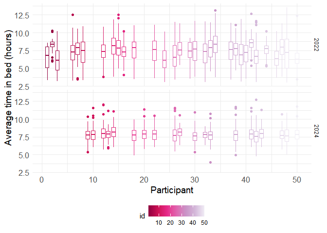
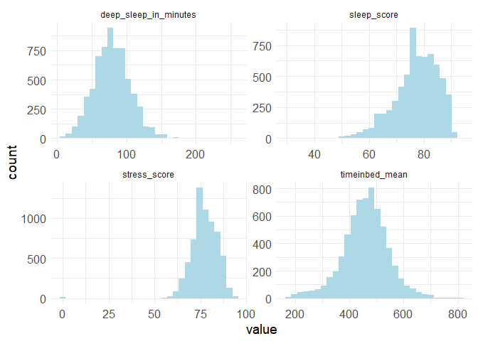
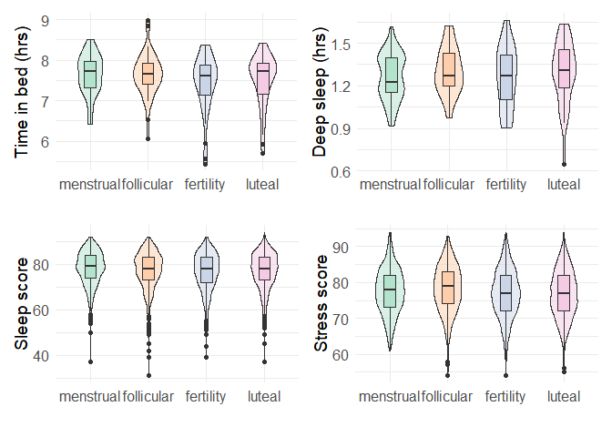
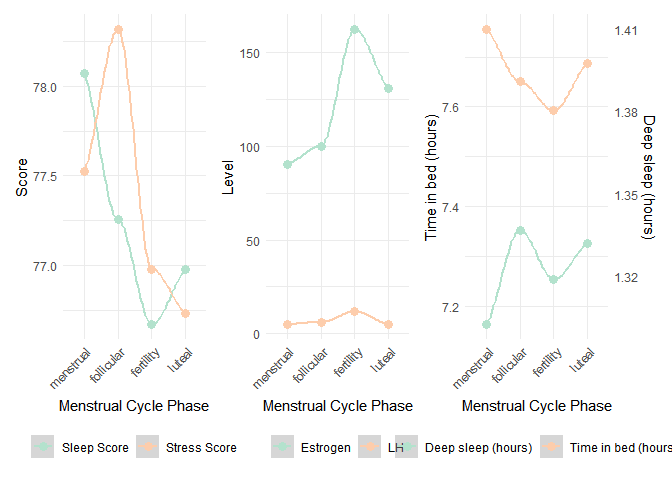
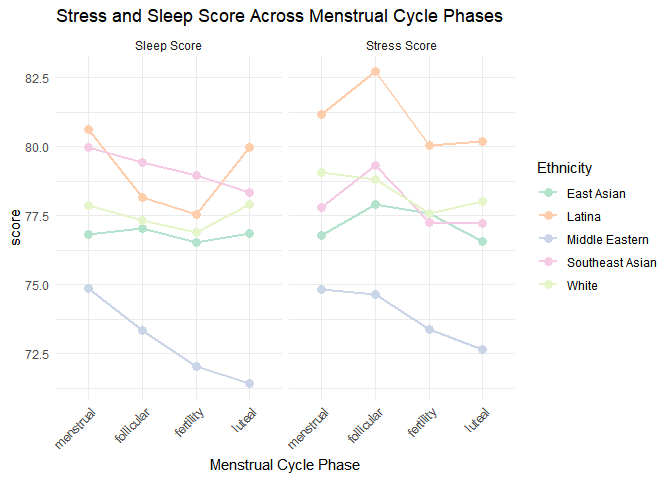
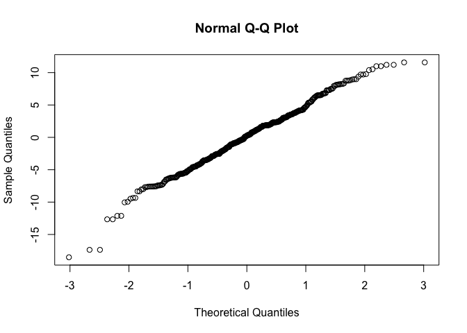

Sleep & stress
================

**View the sleep time for different participants in each study
interval** The average sleep time for each person is different each
study interval and varied across participants. In 2022, some
participants slept less than 5 hours and some slept more than 8 hours.
In 2024, most participants have better sleep length, 7-8 hours.

``` r
# plot the mean timein bed in hour
  sleep_stress_df |>
  filter(!is.na(study_interval)) |>
  ggplot(aes(x = id, y = timeinbed_mean/60, group = id, color = id))+
  geom_boxplot()+
  facet_grid(study_interval ~.) +
  labs(
    x = "Participant",
    y = "Average time in bed (hours)"
  ) 
```

<!-- -->

The dataset has some stress score values equal zero which could be from
an input error. This skewed the stress score histogram. We then remove
the zero value for further analysis. Other continuous variables of our
interest are normally distributed.

``` r
sleep_stress_df |> 
  select(stress_score,sleep_score, timeinbed_mean, deep_sleep_in_minutes) |> 
  pivot_longer(everything()) |> 
  ggplot(aes(value)) + 
  geom_histogram(bins = 30, fill = "lightblue") +
  facet_wrap(~ name, scales = "free")
```

    ## Warning: Removed 28 rows containing non-finite outside the scale range
    ## (`stat_bin()`).

<!-- -->

``` r
# remove zero value in stress score
sleep_stress_df = 
  sleep_stress_df |>
  filter(stress_score != 0)
```

Menstruators spent more time in bed during the menstrual phase; however,
their deep-sleep duration was lowest during this period. This pattern
suggests that although increased physical fatigue during menstruation
may prompt individuals to rest longer, it may simultaneously impair the
ability to achieve restorative sleep. In contrast, during the follicular
phase—when individuals typically experience higher energy
levels—participants spent less time in bed but obtained greater amounts
of deep sleep.

``` r
# plot the variation of time in bed by menstrual phases
timeinbed_plot =
  sleep_stress_df|>
  filter(!is.na(study_interval) & !is.na(phase)) |>
  group_by(phase, id) |>
  summarize(
    timeinbed = mean(timeinbed_mean/60)
  )|> 
  ggplot(aes(x = phase, y = timeinbed, fill = phase)) +
  geom_violin(alpha = 0.5, width = 0.5)+
  geom_boxplot(width = 0.2)+
  labs(
    x = " ",
    y = "Time in bed (hrs)"
  ) +
    theme(legend.position = "none") 
# plot the variation of deep sleep score by menstrual phases
deep_sleep_plot =
   sleep_stress_df|>
  filter(!is.na(study_interval) & !is.na(phase)) |>
  group_by(phase, id) |>
  summarize(
    mean_deep_sleep = mean(deep_sleep_in_minutes/60)
  )|> 
  ggplot(aes(x = phase, y = mean_deep_sleep, fill = phase)) +
  geom_violin(alpha = 0.5, width = 0.5)+
  geom_boxplot(width = 0.2)+
  labs(
    x = " ",
    y = "Deep sleep (hrs)"
  ) +
    theme(legend.position = "none") 
# plot the variation of sleep score by menstrual phases
sleep_score_boxplot =
  sleep_stress_df |>
  filter(!is.na(study_interval) & !is.na(phase)) |>
  ggplot(aes(x = phase, y = sleep_score, fill = phase))+
 geom_violin(alpha = 0.5, width = 0.5)+
  geom_boxplot(width = 0.2)+
  labs(
    x = " ",
    y = "Sleep score"
  ) +
  theme(legend.position = "none")
# plot the variation of stress score by menstrual phases
stress_score_boxplot =
  sleep_stress_df |>
  filter(!is.na(study_interval) & !is.na(phase)) |>
  filter(stress_score != 0)|>
    ggplot(aes(x = phase, y = stress_score, fill = phase))+
  geom_violin(alpha = 0.5, width = 0.5)+
  geom_boxplot(width = 0.2)+
  labs(
    x = " ",
    y = "Stress score"
  ) +
  theme(legend.position = "none")

(timeinbed_plot|deep_sleep_plot)/
(sleep_score_boxplot |stress_score_boxplot)
```

<!-- -->

We further examined variations in stress scores across the menstrual
cycle. Overall sleep quality scores were highest during the menstrual
phase, indicating that participants may benefit from prioritizing rest
during this time. The lowest sleep scores were observed during the
ovulatory (fertile) window, a period characterized by elevated estrogen
and luteinizing hormone (LH) concentrations, which may contribute to
reduced sleep quality. In this scoring system, higher values indicate
lower perceived stress. Participants exhibited the lowest stress levels
during the follicular phase, consistent with increased energy and
improved well-being. Conversely, the highest stress levels were recorded
during the luteal phase.

``` r
# plot the sleep vs stress score by phases
plot_1 = 
  sleep_stress_df |>
  group_by(phase) |>
  summarize(
    mean_sleep_score = mean(sleep_score, na.rm = TRUE),
    mean_stress_score = mean(stress_score, na.rm = TRUE),
    .groups = "drop"
  ) |>
  pivot_longer(
    cols = starts_with("mean_"),
    names_to = "metric",
    values_to = "value"
  ) |>
  mutate(
    metric = recode(metric,
                    mean_sleep_score  = "Sleep Score",
                    mean_stress_score = "Stress Score")
  ) |>
  ggplot(aes(x = phase, y = value, color = metric, group = metric)) +
    geom_smooth(linewidth= 1) +
    geom_point(size = 3) +
    labs(color = "Metric", y = "Mean Score", x = "Phase") +
    labs(
    x = "Menstrual Cycle Phase",
    y = "Score"
  ) +
    theme_minimal() +
  theme(legend.position = "bottom",
        legend.title = element_blank(),
    axis.text.x = element_text(angle = 45, hjust = 1))
# plot the hormone changes
coeff = 5.5
plot_2  =
  sleep_stress_df |>
  group_by(phase) |>
  summarize(
    mean_lh = mean(lh, na.rm = TRUE),
    mean_estrogen = mean( estrogen, na.rm = TRUE),
    .groups = "drop"
  ) |>
  pivot_longer(
    cols = starts_with("mean_"),
    names_to = "metric",
    values_to = "value"
  ) |>
  mutate(
    metric = recode(metric,
                    mean_lh           = "LH",
                    mean_estrogen     = "Estrogen")
  ) |>
  ggplot(aes(x = phase, y = value, color = metric, group = metric)) +
    geom_smooth(linewidth= 1) +
    geom_point(size = 3) +
    labs(color = "Metric", y = "level", x = "Phase") +
    labs(
    x = "Menstrual Cycle Phase",
    y = "Level"
  ) +
    theme_minimal() +
  theme(legend.position = "bottom",
        legend.title = element_blank(),
    axis.text.x = element_text(angle = 45, hjust = 1))
# Plot the time in bed and deep sleep in minutes in phases
plot_3 = 
  sleep_stress_df |>
  group_by(phase)|>
   summarize(
     mean_timeinbed = mean(timeinbed_mean/60, na.rm = TRUE),
    mean_deep_sleep_in_minutes = mean((deep_sleep_in_minutes/60)*coeff, na.rm = TRUE)
             )|>
  pivot_longer(
    cols = starts_with("mean_"),
    names_to = "metric",
    values_to = "value"
  ) |>
  mutate(
    metric = recode(metric,
                    mean_timeinbed             = "Time in bed (hours)",
                    mean_deep_sleep_in_minutes = "Deep sleep (hours)")
  ) |>
  ggplot(aes(x = phase, y = value, color = metric, group = metric)) +
    geom_smooth(linewidth= 1) +
    geom_point(size = 3) +
    labs(color = "Metric", y = "level", x = "Phase") +
    labs(
    x = "Menstrual Cycle Phase",
    y = "Level"
  ) +
  scale_y_continuous(
    
    # Features of the first axis
    name = "Time in bed (hours)",
    # Add a second axis and specify its features
    sec.axis = sec_axis(~./coeff, name="Deep sleep (hours)")
  ) +
    theme_minimal() +
  theme(legend.position = "bottom",
         legend.title = element_blank(),
    axis.text.x = element_text(angle = 45, hjust = 1))
plot_1 + plot_2 + plot_3
```

<!-- -->

**View the stress and sleep score across menstrual cycle phases for each
ethnicity** The figure illustrates mean sleep and stress scores across
menstrual cycle phases, stratified by ethnicity. Overall, sleep scores
show modest fluctuations across phases, with most groups exhibiting
slightly higher sleep quality during the menstrual phase and lower
scores during the fertility (ovulatory) phase. This pattern is most
pronounced in the Middle Eastern group, which demonstrates a steady
decline in sleep score from the menstrual to the luteal phase. Other
groups, including East Asian, Southeast Asian, Latina, and White
participants, show relatively stable sleep scores with minor dips during
the fertility phase.

Stress scores follow a similar cyclical pattern, with most ethnic groups
reporting lower perceived stress (higher stress scores) during the
follicular phase and higher perceived stress (lower stress scores)
during the luteal phase. The Latina group shows the most pronounced
fluctuation, with a peak in stress score during the follicular phase and
a marked decline during the luteal phase. East Asian, Southeast Asian,
and White participants show smaller but consistent shifts that align
with expected hormonal changes across the menstrual cycle.

Together, these trends suggest that both sleep quality and perceived
stress vary systematically across menstrual phases, with ovulation
associated with reduced sleep quality and the luteal phase associated
with increased stress. While the magnitude of these changes differs
across ethnic groups, the overall pattern remains consistent,
highlighting a cyclical relationship between physiological rhythms and
well-being.

``` r
sleep_stress_df |>
  group_by(phase, ethnicity) |>
  summarize(
    mean_sleep_score = mean(sleep_score, na.rm = TRUE),
    mean_stress_score = mean(stress_score, na.rm = TRUE),
    .groups = "drop"
  ) |>
  pivot_longer(
    cols = starts_with("mean_"),
    names_to = "metric",
    values_to = "value"
  ) |>
  drop_na()|>
  mutate(
    metric = recode(metric,
                    mean_sleep_score  = "Sleep Score",
                    mean_stress_score = "Stress Score")
  ) |>
  ggplot(aes(x = phase, y = value, color = ethnicity, group = ethnicity)) +
    geom_line(size = 1) +
    geom_point(size = 3) +
    facet_grid(~ metric) +
    labs(color = "Ethnicity", y = "Mean Score", x = "Phase") +
    labs(
    title = "Stress and Sleep Score Across Menstrual Cycle Phases",
    x = "Menstrual Cycle Phase",
    y = "score"
  ) +
    theme_minimal() +
  theme(axis.text.x = element_text(angle = 45, hjust = 1))
```

<!-- -->
Our dataset are from two studies in two different times, year 2022 and
year 2024 in which the 2024 cohort is a subset from 2022 cohorts.
Therefore the assumptions of independence is violated so we cannot use
statistical tests that required independence assumptions. Instead, we
used generalized linear mixed effects model to evaluate the significant
different of stress score and sleep score between menstrual phases.

A linear mixed-effects model was fitted to examine the association
between menstrual cycle phase and stress score, with menstrual phase as
the reference category and participant included as a random intercept.
The results showed that stress scores during the follicular phase did
not differ significantly from the menstrual phase (estimate = 0.291, SE
= 0.213, p = 0.172). In contrast, stress scores were significantly lower
during the fertility (ovulatory) phase (estimate = –0.594, SE = 0.211, p
= 0.005) and the luteal phase (estimate = –0.525, SE = 0.198, p = 0.008)
compared with the menstrual phase.

Because higher scores reflect lower perceived stress, these negative
estimates indicate that participants experienced more stress during both
the fertility and luteal phases relative to the menstrual phase.
Overall, the model suggests meaningful fluctuations in stress across the
menstrual cycle, with perceived stress notably increased during the
fertility and luteal phases.

``` r
m1 = lmer(stress_score ~ phase +(1 | id) + (1| study_interval), data = sleep_stress_df)
tidy(m1, effects = "fixed", conf.int = TRUE)|>
  select(term, estimate, std.error,p.value, conf.low, conf.high) |>
  mutate(
  significant = ifelse(p.value < 0.05, "Yes", "No")) |>
  knitr::kable(
    title = "Linear mixed effect models for stress score variation by menstrual phases",
    digits = 3)
```

| term            | estimate | std.error | p.value | conf.low | conf.high | significant |
|:----------------|---------:|----------:|--------:|---------:|----------:|:------------|
| (Intercept)     |   76.664 |     0.715 |   0.000 |   75.102 |    78.227 | Yes         |
| phasefollicular |    0.277 |     0.212 |   0.192 |   -0.139 |     0.694 | No          |
| phasefertility  |   -0.583 |     0.211 |   0.006 |   -0.997 |    -0.170 | Yes         |
| phaseluteal     |   -0.528 |     0.197 |   0.007 |   -0.915 |    -0.141 | Yes         |

A linear mixed-effects model was used to evaluate differences in sleep
scores across menstrual cycle phases, with the menstrual phase serving
as the reference category and participant modeled as a random intercept.
The results showed significant reductions in sleep score during all
non-menstrual phases. Compared with the menstrual phase, sleep scores
were significantly lower during the follicular phase (estimate = –1.037,
SE = 0.283), the fertility (ovulatory) phase (estimate = –1.342, SE =
0.281), and the luteal phase (estimate = –1.126, SE = 0.263), with all
effects statistically significant (p \< 0.001).

Because higher scores reflect better sleep quality, these negative
estimates indicate that participants slept worse during the follicular,
fertility, and luteal phases compared with the menstrual phase. The
largest decrease in sleep score occurred during the fertility phase,
suggesting that ovulation is associated with the poorest sleep quality.
Overall, the model demonstrates that sleep quality varies systematically
across the menstrual cycle, with the menstrual phase representing the
period of highest sleep quality.

``` r
m2 = lmer(sleep_score ~ phase +(1 | id), data = sleep_stress_df)
tidy(m2, effects = "fixed", conf.int = TRUE)|>
  select(term, estimate, std.error,p.value, conf.low, conf.high) |>
  mutate(
  significant = ifelse(p.value < 0.05, "Yes", "No")) |>
  knitr::kable(digits = 3)
```

| term            | estimate | std.error | p.value | conf.low | conf.high | significant |
|:----------------|---------:|----------:|--------:|---------:|----------:|:------------|
| (Intercept)     |   77.436 |     0.709 |       0 |   76.003 |    78.869 | Yes         |
| phasefollicular |   -1.037 |     0.283 |       0 |   -1.591 |    -0.483 | Yes         |
| phasefertility  |   -1.342 |     0.281 |       0 |   -1.892 |    -0.792 | Yes         |
| phaseluteal     |   -1.126 |     0.263 |       0 |   -1.641 |    -0.611 | Yes         |

``` r
m3 = lmer(timeinbed_mean ~ phase +(1 | id), data = sleep_stress_df)
tidy(m3, effects = "fixed", conf.int = TRUE)|>
  select(term, estimate, std.error,p.value, conf.low, conf.high) |>
  mutate(
  significant = ifelse(p.value < 0.05, "Yes", "No")) |>
  knitr::kable(digits = 3)
```

| term            | estimate | std.error | p.value | conf.low | conf.high | significant |
|:----------------|---------:|----------:|--------:|---------:|----------:|:------------|
| (Intercept)     |  458.906 |     5.444 |   0.000 |  447.929 |   469.883 | Yes         |
| phasefollicular |   -6.089 |     3.182 |   0.056 |  -12.326 |     0.148 | No          |
| phasefertility  |  -10.346 |     3.160 |   0.001 |  -16.542 |    -4.151 | Yes         |
| phaseluteal     |   -4.710 |     2.957 |   0.111 |  -10.506 |     1.086 | No          |

With an estimate of 0.032 and a p-value of 0.043 (which is less than the
typical significance level of 0.05), this variable is a significant
positive predictor of stress score. This suggests that, on average, for
every additional minute of deep sleep, the stress score is predicted to
increase by 0.032 points, assuming other variables are constant. Time in
bed is a is a significant positive predictor of stress score ( p =
0.013) For every additional minute in bed (mean), the stress score is
predicted to increase by 0.009 points, holding all other variables
constant. The 95% confidence intervals for the significant predictors
(deep_sleep_in_minutes and timeinbed_mean) do not contain zero, further
supporting their statistical significance. When we explore more
variables, the menstrual phases do not affect the stress score
significantly.

``` r
#  model
m4 <- lmer(stress_score ~ phase + deep_sleep_in_minutes +
           timeinbed_mean + total_active_min + moodswing_score +(1 | id), data = sleep_stress_df)
tidy(m4, effects = "fixed", conf.int = TRUE)|>
  select(term, estimate, std.error, conf.low, conf.high,p.value) |>
  mutate(
  significant = ifelse(p.value < 0.05, "Yes", "No")) |>
  knitr::kable(digits = 3)
```

| term | estimate | std.error | conf.low | conf.high | p.value | significant |
|:---|---:|---:|---:|---:|---:|:---|
| (Intercept) | 73.254 | 1.848 | 69.591 | 76.917 | 0.000 | Yes |
| phasefollicular | -1.166 | 0.866 | -2.869 | 0.536 | 0.179 | No |
| phasefertility | -0.964 | 0.854 | -2.643 | 0.714 | 0.259 | No |
| phaseluteal | -0.840 | 0.753 | -2.321 | 0.641 | 0.265 | No |
| deep_sleep_in_minutes | 0.032 | 0.016 | 0.001 | 0.063 | 0.043 | Yes |
| timeinbed_mean | 0.009 | 0.004 | 0.002 | 0.016 | 0.013 | Yes |
| total_active_min | -0.009 | 0.008 | -0.024 | 0.006 | 0.232 | No |
| moodswing_score | -0.199 | 0.255 | -0.701 | 0.303 | 0.436 | No |

``` r
# check the residuals
qqnorm(residuals(m4)) 
```

<!-- -->

**Discussion** This analysis cyclical variations in sleep quality and
perceived stress across the menstrual cycle using mixed-effects models
to account for repeated measures within individuals. The findings
demonstrate consistent and meaningful changes in both sleep and stress
that align with known physiological fluctuations across the menstrual
phases.

Sleep quality was highest during the menstrual phase and decreased
significantly during the follicular, fertility, and luteal phases.
Notably, the fertility (ovulatory) phase showed the largest decline in
sleep score, suggesting that the hormonal surge—particularly in estrogen
and luteinizing hormone—may disrupt restorative sleep. This pattern
aligns with previous research indicating that ovulation can be
associated with increased physiological arousal and thermoregulatory
changes, which may impair sleep continuity and depth. Despite spending
more time in bed during menstruation, participants achieved better sleep
quality during this phase, possibly reflecting a compensatory
physiological need for rest.

Stress scores followed a complementary pattern: participants experienced
the lowest stress (i.e., highest stress scores) during the menstrual
phase and the highest stress during the fertility and luteal phases. The
increase in stress during the luteal phase is consistent with known
premenstrual symptoms such as mood fluctuations, irritability, and
heightened emotional sensitivity. The elevated stress during the
ovulatory window may reflect endocrine-driven changes that influence
emotional reactivity or cognitive load. Together, these results
underscore the interconnected nature of hormonal rhythms, stress
regulation, and sleep quality across the menstrual cycle. **Limitation**
The sample size and ethnic distribution may limit generalizability; some
ethnic groups were represented by fewer participants, potentially
affecting the stability of subgroup trends. In addition, leep and stress
scores were derived from self-reported or device-based composite
measures, which may not capture the full complexity of physiological
processes such as sleep architecture or cortisol variation.
